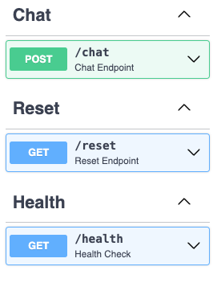
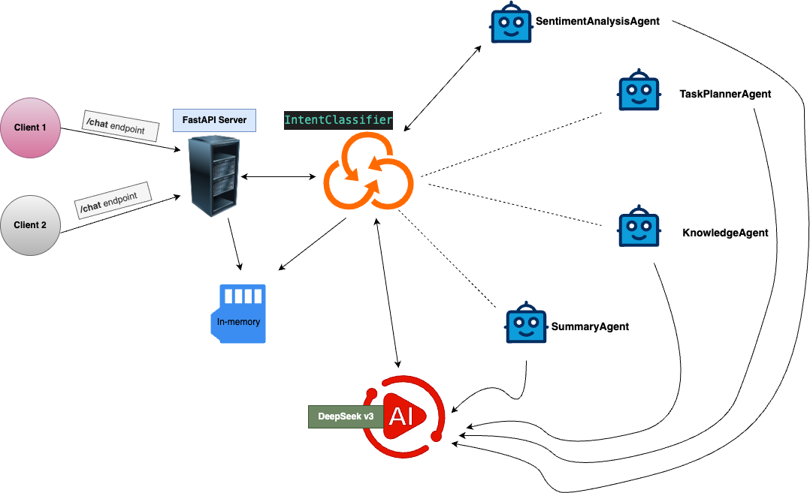
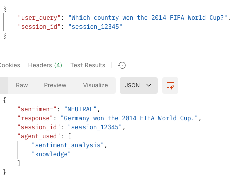
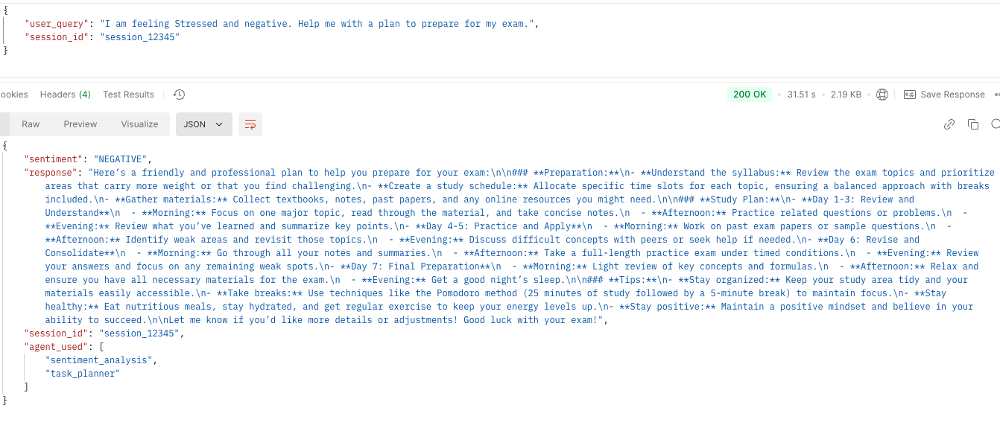
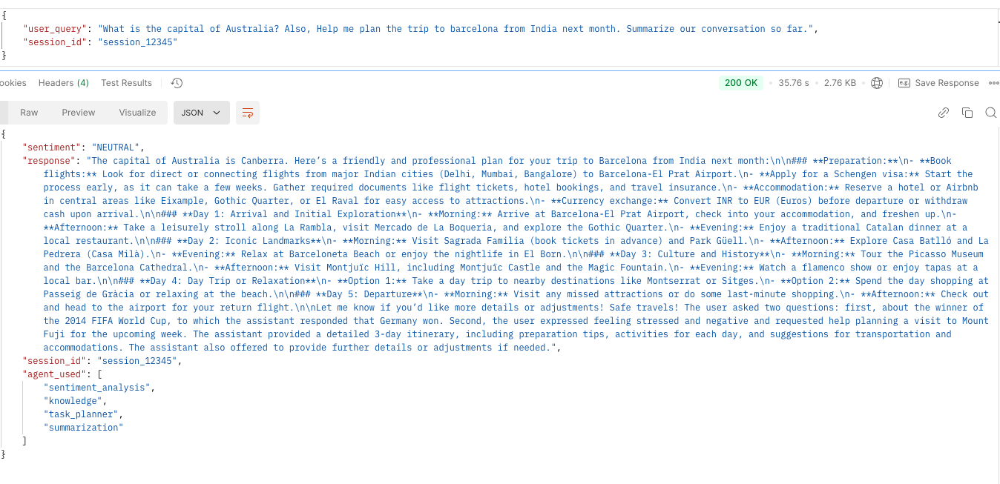

# RevUp-assessment

An API that facilitates a multi-agent conversational system to assist users in managing tasks, answering general questions, analyzing sentiments, and summarizing the conversation.

•<b>Make sure to checkout</b> [Problem Statement and Documentation](./docs/RevUp%20-%20Problem%20Statement.pdf).

•<b>Watch my implementation in action (use 1.5x speed):</b> [Presentation Video](https://www.loom.com/share/2efdd22beaf94568abcbd39ddedeaedc).

## Installation

```sh
# Clone the repository
git clone git@github.com:10kartik/RevUp-assessment.git
# Change directory to the repository
cd RevUp-assessment

# Create a virtual environment and install the dependencies
python3 -m venv my_virtual_environment
source my_virtual_environment/bin/activate
pip install -r requirements.txt
```

## Usage

- set the environment variable `FIREWORKS_API_KEY` to the API key for the [Fireworks API](https://fireworks.ai/account/api-keys). Edit sample.env for reference.
- Refer [Postman Collection](./docs/postman_collection.json) for API usage.

```sh
# Start the server
uvicorn server:app --host 127.0.0.1 --port 8000
```

## API Endpoints

[](./docs/openapi.yaml)

## Architecture Diagram



### Intent Classification and Context Management

- <b>Developed an IntentClassifier class</b> - an Orchestrator that uses the Fireworks API to classify the intent of the user query, and decides the specific agent(s) that should handle the query based on the intent. The class is responsible for invoking the appropriate agent(s) to handle the query. It provides a JSON response like

```
{'agent_name_1':'associated query', 'agent_name_2':'associated query'}
```

- <b>Developed a SessionManager class</b> that manages the context of the conversation with the user. It maintains the state of the conversation, and the context of the conversation with the user by storing the conversation history in-memory. Ideally, it should be a persistent storage like MongoDB.

### Agents

1. <b>TaskPlannerAgent:</b> Helps users break down tasks into subtasks and prioritize them.
2. <b>KnowledgeAgent:</b> Answers factual questions using OpenAI's GPT model.
3. <b>SentimentAnalysisAgent:</b> Analyzes user input for sentiment and provides a response accordingly.
4. <b>SummarizationAgent:</b> Summarizes the conversation with the user.

### Libraries and Frameworks

- <b>FastAPI:</b> A modern, fast (high-performance), web framework for building APIs with Python 3.7+ based on standard Python type hints.
- <b>Fireworks API:</b> A platform that provides Open-source large language models deployed as RESTful APIs.
- <b>DeepSeekV3:</b> DeepSeek 128K Context model provided by DeepSeek AI.
- <b>LangChain:</b> A library that provides a simple interface to initialize agents and interact with them.
- <b>Pydantic:</b> Data validation and settings management using Python type annotations.
- <b>Uvicorn:</b> A lightning-fast ASGI server implementation, using uvloop and httptools.

### Screenshots

##### Sentiment Agent and Knowledge Agent:



##### Sentiment Agent and TaskPlanning Agent:



##### Multi-Agent Query, Sentiment Agent, Knowledge Agent, TaskPlanning Agent and Summarization Agent:


